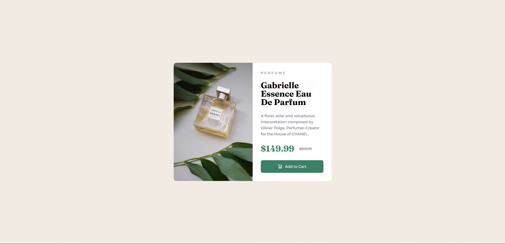

# Frontend Mentor -Product preview card component solution
This is a solution to the [Product preview card component on Frontend Mentor](https://www.frontendmentor.io/challenges/product-preview-card-component-GO7UmttRfa). Frontend Mentor challenges help you improve your coding skills by building realistic projects.

## Content
- [Project idea](#project-idea)
- [Screenshots](#screenshots)
- [Solution link](#solution-link)
- [Build with](#built-with)
- [What i learned](#what-i-learned)
- [Autor](#autor)

## Project idea

This challenge was to create a simple project to exercice our habilitites by creating a centrilized preview card of a permufe product and it's responsive mobile layout.

## Screenshots

- Desktop version

- Mobile version

## Solution link
- Live server URL: [Live site at GitHub-Pages](https://viniciusmontibeller.github.io/product-preview-card-frontend-mentor/)

## Built with
 - HTML5
 - CSS
 - Responsive Design

## What i learned
  I got to use what a have learned and got better at positioning elements and to analize better the spaces between them, better understanding of how to use media querries for a more responsive layout, and how to work with more then one font

## Useful resources

 - [Dev em Dobro](https://github.com/devemdobro)

## Autor
 - Github - [viniciusmontibeller](https://github.com/viniciusmontibeller)
 - Frontend Mentor - [@viniciusmontibeller](https://www.frontendmentor.io/profile/viniciusmontibeller)
 

 ## Acknowledgments

I got to say that i'm really happy to be studying with the lessons by [Dev em Dobro](https://github.com/devemdobro). I started with zero programing skills and now i can see that i'm growing little by little into what i wanted to be.